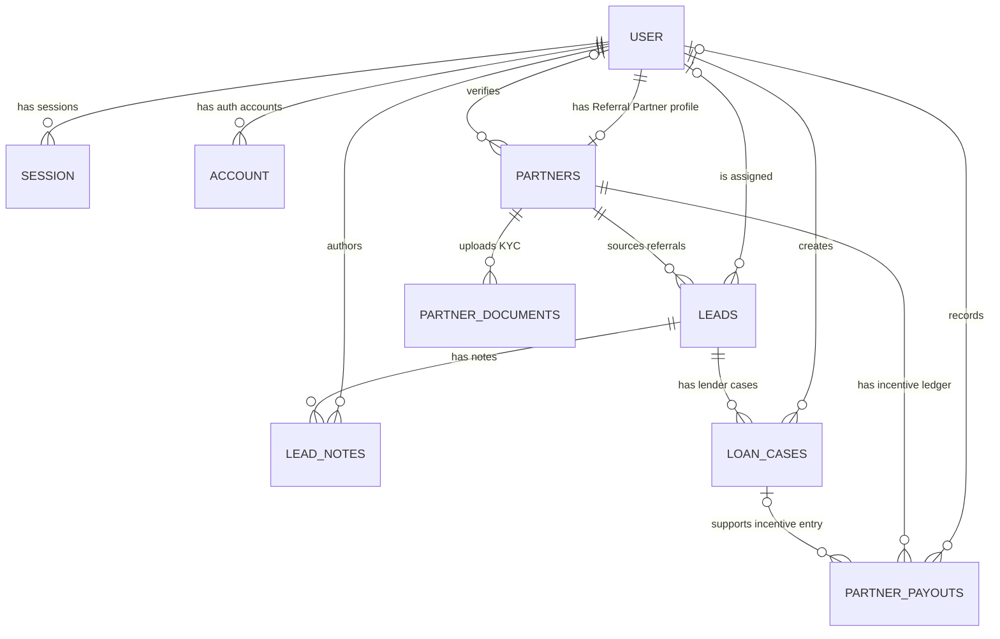

# Architecture

## Boundaries

TrueLend has three independent Worker capabilities:

| App      | Public surface                                | Privileged capabilities                           |
| -------- | --------------------------------------------- | ------------------------------------------------- |
| Website  | Content, enquiry, referral, and contact forms | Lead database writes; no auth or KYC bucket       |
| Admin    | Staff login and internal operations           | Staff-authorized database mutations and KYC reads |
| Partners | Referral Partner registration and portal      | Referral-scoped writes and private KYC uploads    |

The website must never receive a KYC R2 binding. Admin and partners currently bind the same private
bucket; that capability-wide access is a known external hardening gap, not proof of isolated read-only
admin access.

## Dependency direction

```text
apps/*  -> focused packages/*
packages/ui -> no application domain imports
packages/reference -> pure domain data and policy, no database imports
packages/db -> persistence schema and client
packages/* -X-> apps/*
app A -X-> app B
```

App directories own routes and thin server boundaries. Reusable app UI belongs in `components/`,
app-only logic in `lib/`, and behavior shared across apps in the smallest existing domain package.
Repository-policy tests enforce centralized dependency versions, workspace transpilation, the public
website storage boundary, and selected source-boundary rules.

## Request model

- Server Components are the default.
- Every protected route/action enforces server-side authentication and authorization.
- Database and auth objects are created per request; Worker I/O objects are never cross-request
  singletons.
- Route handlers and server actions that own a database client close it with `ctx.waitUntil()`.
- Worker bindings come from `getCloudflareContext().env`; Node scripts are the explicit exception.

## Server-to-client data

Persistence rows do not cross a React Server Component to Client Component boundary. The server maps
them to explicit, minimal DTOs containing only fields required for rendering or editing. In
particular, internal object keys, review metadata, banking details, and identity fields are never
serialized merely because a component accepts a database entity type. A repository test rejects
`@truelend/db` imports from client modules.

## Canonical policy

- `packages/reference/src/partner-review.ts` owns Referral Partner application completeness,
  editability, submission, and approval policy.
- `packages/reference/src/leads.ts` owns shared lead options and the lead-consent version;
  focused sibling modules own the other domain values exported by `src/index.ts`.
- `packages/db/src/schema.ts` is the persistence source of truth.
- `packages/ui/src/theme.css` is the brand-token source of truth.

Pure policy is kept outside server-action modules so both apps and focused tests consume exactly the
same rules.

## Referral-only data model

`packages/db/src/schema.ts` defines 11 PostgreSQL tables. The `partners` table name remains stable for
route, binding, and migration compatibility, but it now represents only Referral Partners. There is
no partner-type discriminator, Business Partner role, business profile, GST KYC document, or
Business Partner reference code. New Referral Partner references use the `RP<sequence>` format.



| Entity              | Responsibility                                                                  |
| ------------------- | ------------------------------------------------------------------------------- |
| `user`              | Shared Better Auth identity and role (`admin`, `employee`, `referral`, pending) |
| `session`           | Better Auth sessions owned by a user                                            |
| `account`           | Better Auth credential/provider accounts owned by a user                        |
| `verification`      | Better Auth single-use verification records                                     |
| `partners`          | One-to-one Referral Partner profile, KYC data, review state, and `RP` ID        |
| `partner_documents` | Private R2 KYC-object metadata; one current object per document type            |
| `leads`             | Website or Referral Partner borrower enquiries and attribution                  |
| `lead_notes`        | Staff-authored notes attached to a lead                                         |
| `loan_cases`        | Per-lender processing attempts for a lead, including paise-denominated amounts  |
| `partner_payouts`   | Referral Partner incentive ledger (`earned` and `paid`)                         |
| `audit_log`         | Append-only evidence for privileged or sensitive state changes                  |

`audit_log` intentionally has no foreign keys so historical evidence survives identity or domain
record removal. `verification` is managed by Better Auth and is not an application-domain relation.
KYC binaries stay in private R2; `partner_documents` stores only their keys and bounded metadata.
Referral registration writes the partner's date of birth, city, referral type, mobile number, and
optional PAN/experience directly to `partners`; later onboarding extends that same one-to-one row
with professional, address, nominee, banking, and review fields. Loan products are a reference
catalog rather than database rows, so removing the Business Partner program does not remove Business
Loan or any other loan type offered to Referral Partners.

## Release model

Pull requests run the repository gate and build, dry-run, and scan every deployable Worker artifact.
On `main`, the production Environment is entered before configuration preflight and database
migration; deployments follow only after migration succeeds and are health-checked with rollback on
failure.

The workflow declaration is not external evidence. GitHub Environment reviewers, branch protection,
secret scope, Cloudflare Access/MFA, bucket privacy, database identities, monitoring, and recovery
exercises must be verified separately.
